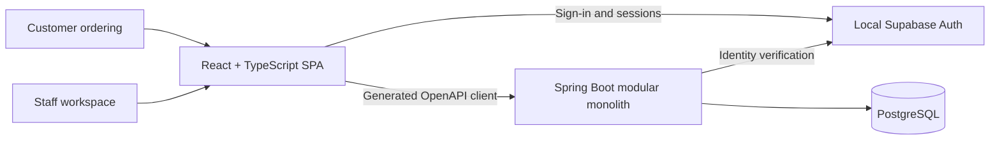

<div align="center">
  

  # Bubble Tea Shop

  **A complete ordering and shop-operations application for an independent bubble tea store.**

  Browse and customize drinks, place cash pickup orders, manage the menu and inventory, and move
  orders safely from checkout to completion—all in one local-first application.

  [](https://github.com/Cyrus-Krispin/bubble-tea-shop/actions/workflows/ci.yml)
</div>

## What it does

Bubble Tea Shop brings the customer counter and the staff workspace together without compromising
the business rules behind them. Guests get a fast, account-optional ordering flow. Staff get the
tools to run the catalog, stock, and order queue. PostgreSQL and Spring keep pricing, permissions,
inventory, and order completion authoritative on the server.

### Customer experience

- Browse a live, database-backed menu by category and availability.
- Customize size, sweetness, ice, milk, and toppings with server-owned pricing.
- Review a cart and place an idempotent cash pickup order as a guest.
- Optionally create an account or sign in without crossing into staff access.
- Use a responsive, WCAG-conscious interface designed for mobile ordering.

### Staff operations

- Manage ingredients, immutable recipe versions, products, variants, prices, and options.
- Record stock receipts and adjustments against an auditable inventory ledger.
- Process the live order queue, record cash collection, and complete orders safely.
- Deduct recipe consumption atomically and reject completion when stock is insufficient.
- Review operational audit history and manage location-scoped manager access.

## Application architecture



The backend is a Java 21 modular monolith organized around four domain boundaries:
`identity`, `catalog`, `inventory`, and `ordering`. Spring owns workflows and authorization;
PostgreSQL owns relational integrity; Flyway is the only schema-change mechanism. The React SPA
uses a generated OpenAPI client and never ships fallback catalog or business data.

| Layer | Technology | Responsibility |
| --- | --- | --- |
| Web application | React 19, TypeScript, Vite | Customer ordering, accounts, and staff operations |
| Application API | Java 21, Spring Boot 4 | Domain workflows, authorization, validation, and OpenAPI |
| Data | PostgreSQL, Flyway, JPA | Transactional state, constraints, migrations, and persistence |
| Identity | Self-hosted Supabase Auth, Kong | Local sign-in, sessions, JWT issuing, and public JWKS |
| Delivery | Docker Compose, Nginx, GitHub Actions | Reproducible local stack, production build, and quality gates |
| Monitoring | Prometheus, Grafana, Spring Actuator | Local metric collection and operational dashboards |

Read the [architecture overview](docs/architecture/overview.md) for module boundaries and the
[MVP product scope](docs/product/mvp.md) for the supported workflows.

## Run it locally

### Prerequisites

- Docker Desktop, installed and running
- Node.js 24 (used once to generate local Auth keys)

### Start the complete stack

```bash
cp .env.example .env
node infra/supabase/generate-local-auth-keys.mjs >> .env
docker compose up --build
```

The first run pulls the pinned images and downloads build dependencies. After the services become
healthy, open [localhost:4173](http://localhost:4173) to browse the shop.
Open [localhost:3000](http://localhost:3000) for the provisioned system dashboard; Grafana uses
anonymous, read-only access in this loopback-only development stack.
If another Docker runtime was previously installed, confirm that `docker context show` reports
`desktop-linux` before starting the stack.

### Local URLs

These URLs use the default ports from `.env.example`. Every published service binds to
`127.0.0.1`, so the development stack is available only from the local machine.

| Local service | URL | Use |
| --- | --- | --- |
| Customer and staff application | <http://localhost:4173> | Guest ordering, customer accounts, and staff operations |
| Frontend health | <http://localhost:4173/health> | Nginx/frontend container readiness |
| Supabase Studio | <http://localhost:54323> | Local database, SQL, and Auth administration UI |
| Swagger UI | <http://localhost:8080/swagger-ui.html> | Interactive Spring API documentation |
| OpenAPI JSON | <http://localhost:8080/v3/api-docs> | Machine-readable runtime API contract |
| Spring Actuator | <http://localhost:8080/actuator> | Available operational endpoints |
| Spring Boot health | <http://localhost:8080/actuator/health> | Backend and database readiness |
| Prometheus metrics | <http://localhost:8080/actuator/prometheus> | Spring application metrics |
| Grafana dashboard | <http://localhost:3000> | Provisioned RED, JVM, process, log-rate, and database-pool charts |
| Prometheus | <http://localhost:9090> | Local metric collection, storage, and PromQL exploration |
| Supabase Auth health | <http://localhost:8000/auth/v1/health> | Local Auth readiness |
| Supabase Auth JWKS | <http://localhost:8000/auth/v1/.well-known/jwks.json> | Public JWT verification keys |
| PostgreSQL | `localhost:54322` | Host and port for database clients |

### Automatic local users

Compose creates or reconciles these public, development-only accounts before starting the
frontend:

| Access | Email | Password | Scope |
| --- | --- | --- | --- |
| Customer | `user@user.com` | `User@1234` | Customer account with no staff access |
| Manager | `manager@manager.com` | `Manager@1234` | Manager access to every active seeded location |
| Owner | `owner@owner.com` | `Owner@1234` | Organization-wide owner access |

The credentials are fixed local fixtures and must never be reused in shared, staging, or
production environments. Re-running Compose is safe: the bootstrap reconciles the passwords and
repairs the owner and manager access without creating duplicate accounts.

Stop the stack without deleting its database volume:

```bash
docker compose down
```

See the [local development guide](docs/development/local-docker.md) for health checks, owner
bootstrap, configuration, and lifecycle details.

## Quality gates

The CI pipeline verifies the same boundaries the application depends on:

- Backend integration tests run against PostgreSQL with Testcontainers.
- Frontend tests, accessibility checks, OpenAPI drift checks, types, lint, and builds must pass.
- Local Auth infrastructure scripts are tested independently.
- The production containers are built and exercised through desktop and mobile browser flows.

Run the main suites directly when working outside Compose:

```bash
# Backend (Docker is required for Testcontainers)
cd backend && ./mvnw verify

# Frontend
cd frontend
pnpm install --frozen-lockfile
pnpm test && pnpm typecheck && pnpm lint && pnpm build
```

## Repository guide

| Path | Contents |
| --- | --- |
| [`backend/`](backend/) | Spring modules, Flyway migrations, and integration tests |
| [`frontend/`](frontend/) | React SPA, reusable UI primitives, Storybook, and browser tests |
| [`docs/`](docs/) | Product, architecture, API, database, delivery, and operations documentation |
| [`infra/`](infra/) | Local Supabase configuration plus backup and restore tooling |
| [`compose.yaml`](compose.yaml) | The complete local application stack |

Start with the [documentation index](docs/README.md) for deeper technical and product context.

## Current scope

The implemented MVP supports one active shop location, guest and signed-in customer cash orders,
customer accounts, owner and manager access, catalog and recipe management, inventory movements,
order operations, and operational audit views. Card payments, customer order history, forecasting,
multiple active locations, and opt-in face authentication remain later-release work.
