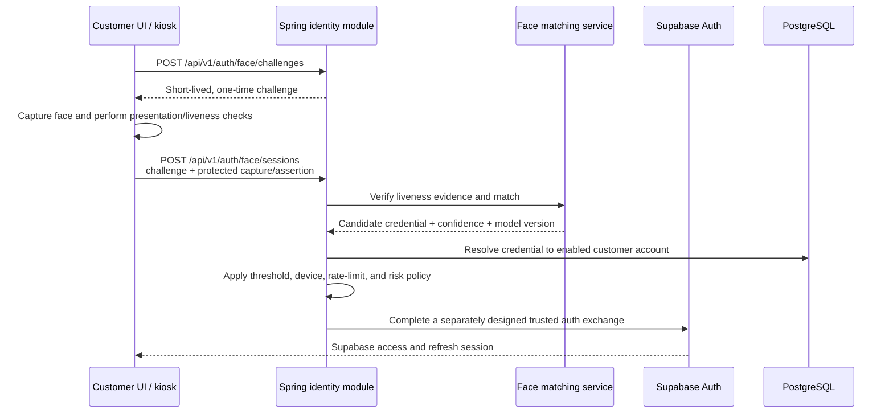

# Future Face Authentication

Face authentication is deferred until customer accounts exist. It is an alternative way to prove
which account is present; it does not replace the JWT session system.

## Intended scope

- Customer use only at first. Owner and manager access continues to require password/passkey login
  and, when introduced, MFA.
- Enrollment is opt-in and requires an already authenticated customer plus explicit consent.
- Customers can remove their face credential and must always have a non-biometric login/recovery
  path.
- An unknown, ambiguous, low-confidence, or failed-liveness result does not log anyone in and falls
  back to normal login without revealing candidate accounts.
- A privacy and legal review is required before collection because face templates are sensitive
  biometric data.

Face identification is a one-to-many search: a captured face is compared with enrolled customers
to find a candidate account. This has a higher false-match and privacy risk than one-to-one
verification, where a customer first identifies their account and then proves that the face
matches it. Prefer one-to-one verification unless the hands-free identification experience is a
firm product requirement.

## Authentication and JWT flow

The face matching component never creates JWTs. It returns a narrowly scoped match result to the
Spring identity module. Only the identity module may decide that the biometric check succeeded and
resolve the credential to an enabled `account`; only Supabase Auth may issue the resulting access
and refresh session. The trusted exchange shown above is conceptual and requires a separate design
and threat model before implementation.

On success, token handling must remain identical to other Supabase Auth sessions:

- Supabase owns access-token lifetime, refresh rotation, and logout behavior.
- The JWT `sub` remains the Supabase user ID; Spring resolves application identity and current
  authorization from server-side data.
- Do not put a face image, face template, match score, or biometric credential ID in a JWT.
- Refreshing a session does not run face matching again.

`amr` is audit and risk context, not authorization. Roles and access are still loaded from current
server-side account, membership, and assignment state. Sensitive operations may require a recent
password, passkey, or MFA check even when the current session began with a face match.

## Enrollment and storage

Enrollment should be a separate authenticated workflow:

1. Re-authenticate the customer using a non-biometric method.
2. Show the purpose, retention period, deletion behavior, and consent choice.
3. Capture multiple samples with quality and presentation/liveness checks.
4. Convert samples into a provider/model-specific template.
5. Store an encrypted template or an opaque provider reference linked to the account.
6. Record consent, model/version, timestamps, status, and an audit event.
7. Delete transient raw captures unless a separately reviewed requirement justifies retaining
   them.

A later migration will need a table conceptually like `biometric_credential` with:

- `id`, `account_id`, `type`, `status`, `provider`, and `model_version`;
- encrypted template material or an opaque external reference, never a plain face image;
- `enrolled_at`, `last_used_at`, `revoked_at`, and consent/retention metadata.

Biometric keys must be separate from normal application secrets and support rotation. Templates
must not be logged, placed in analytics, returned through general account APIs, or reused across
organizations or unrelated purposes.

## Abuse and failure controls

- Require presentation-attack/liveness detection; a still photo or replayed video must not be
  sufficient.
- Bind each short-lived challenge to the browser/kiosk session, origin, intended location, and a
  nonce, and allow one use only.
- Register and authenticate store kiosks as managed devices. A public browser should not be able to
  call unrestricted one-to-many identification.
- Rate-limit attempts by device, network, and credential; monitor false accepts, false rejects,
  spoof attempts, and threshold changes.
- Use a conservative server-owned match threshold. Never accept a client-provided account ID,
  score, or “matched” flag as proof.
- Treat multiple close candidates as no match. Return a generic failure and allow password,
  passkey, QR, or staff-assisted recovery.
- Revoke biometric credentials independently from refresh sessions. Account disablement and
  security events should revoke both.
- Avoid silently switching an active session when another face enters view. Automatic recognition
  should ask for a deliberate confirmation before establishing or changing the signed-in account.

## Delivery sequence

1. Build customer accounts and the standard Supabase Auth sign-in/session flow.
2. Add biometric consent, enrollment, deletion, and audit records.
3. Evaluate on-device/platform biometric authentication where it can satisfy the experience; it
   avoids central face identification.
4. If one-to-many recognition remains necessary, select and threat-model a matching/liveness
   component and define measurable acceptance thresholds.
5. Add challenge and face-session endpoints behind a feature flag.
6. Pilot on registered devices with test identities, then complete security, accessibility,
   privacy, bias, and operational reviews before production use.
