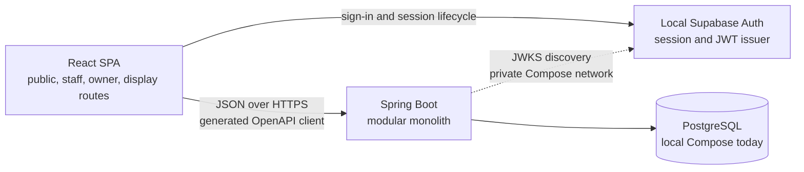

# Architecture Overview

## System shape

The application is a modular monolith:

Spring is the only custom application backend. The React application does not introduce a Node
server at runtime or bypass Spring for domain operations. A self-hosted Supabase Auth service is
the local authentication issuer; it does not replace Spring or the application database.
PostgreSQL owns relational integrity; Spring owns workflows and server-side authorization.

## Backend modules

| Module | Responsibility | May depend on |
|---|---|---|
| `identity` | Supabase identity mapping, organizations, locations, accounts, memberships | shared infrastructure |
| `catalog` | Ingredients, recipes, products, variants, choices, offerings | identity identifiers |
| `inventory` | Balances, immutable movements, manual stock transactions | identity and catalog identifiers |
| `ordering` | Order snapshots, payments, status history, completion | identity, catalog, inventory |

Entities are persistence details and are not returned directly from controllers.
Cross-module changes go through application services rather than writing another module's tables
from controllers.

## Frontend direction

The frontend is one React/TypeScript/Vite SPA:

- `app` owns routing and providers.
- `features` groups screens and behavior by backend domain.
- `components/ui` owns tokens and accessible Radix-based components.
- Guest catalog pages load server-owned values from Spring; TanStack Query remains planned for
  broader server-state caching.
- The API client is generated from Spring's OpenAPI document.

## Runtime configuration

- All timestamps are stored in UTC; location timezone is used at presentation/report boundaries.
- Supabase signing material and other secrets are environment-injected and never committed or
  seeded by Flyway.
- `ddl-auto=validate` ensures mappings match migrations without allowing Hibernate to alter schema.
- Local development uses PostgreSQL, Supabase Auth, its gateway, and Spring through Compose. The
  backend retrieves only public verification keys from the private network and uses no hosted
  Supabase service.
