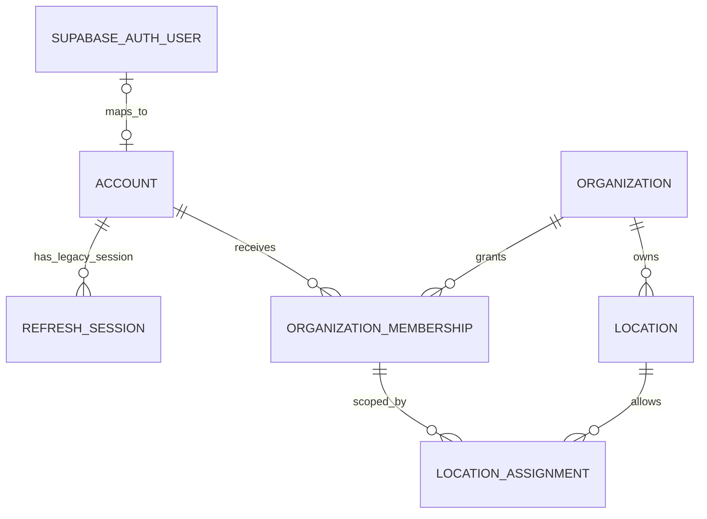
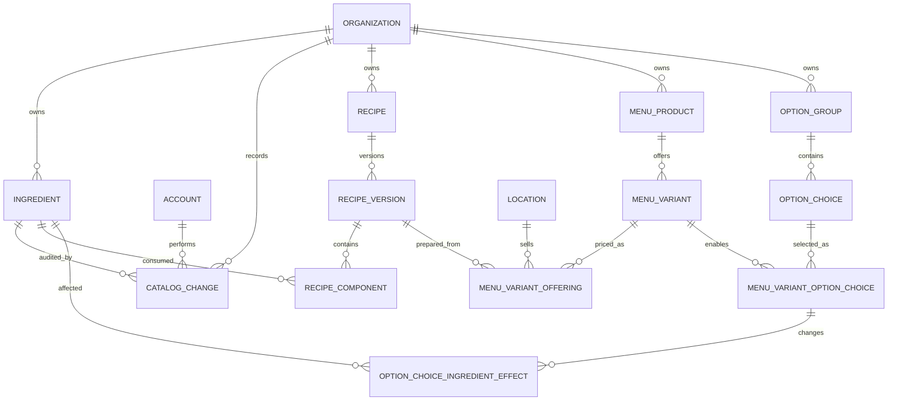
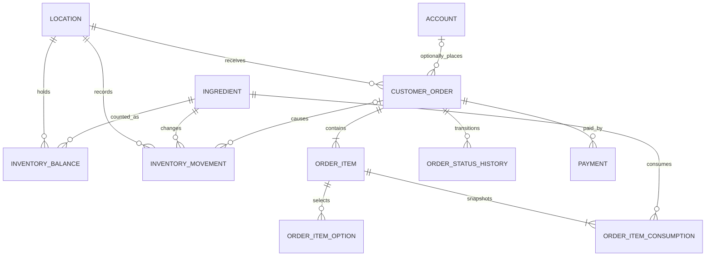

# Database ERD

The diagrams are split by concern for readability. `organization_id` is repeated through owned
tables to support composite foreign keys that reject cross-organization references. V2 adds public
slugs and presentation metadata to the existing location/product relationships and seeds the local
guest catalog; it does not introduce another entity relationship.

V4 maps an application `ACCOUNT` to at most one external Supabase Auth subject. The
`REFRESH_SESSION` relationship belongs to the superseded custom-auth design and is not the target
Supabase session model; its later removal or archival is still undecided.

V5 adds optimistic versions and durable, actor-attributed change records for ingredient management.
V6 extends those controls to recipe metadata and formula versions, permits only one draft per
recipe, and serializes offering activation with recipe retirement or archival.
V7 extends optimistic versions and catalog auditing to products, variants, offerings, option
definitions, and variant-choice configuration. Deferred validation keeps available menus
satisfiable across atomic default and ingredient-effect changes.
V8 adds a partial uniqueness guard for one opening inventory movement per location and ingredient.

## Identity

## Catalog

## Inventory and ordering

