# Database Schema Reference

This page is a human-readable reference for the current PostgreSQL schema. The executable source
of truth is
[`V1__create_mvp_schema.sql`](../../backend/src/main/resources/db/migration/V1__create_mvp_schema.sql).
When the migration and this page disagree, the migration wins and this page must be corrected.

The V1 `account` credential fields and `refresh_session` table reflect the superseded
application-owned authentication design. They remain documented because they are implemented
schema. Local Supabase Auth is now the selected authentication issuer; a new migration will be
needed after the identity mapping and legacy-data lifecycle are decided.

## Legend

- **PK**: primary key.
- **FK**: foreign key.
- **UQ**: unique constraint or unique index.
- **NN**: `NOT NULL`.
- A dash in the Key column means the column is not itself part of a key.
- Composite foreign keys repeat `organization_id` deliberately. They prevent a row from connecting
  records owned by different organizations.
- PostgreSQL defaults shown below are database-side defaults.

## Relationship overview

```mermaid
erDiagram
    ORGANIZATION ||--o{ LOCATION : owns
    ORGANIZATION ||--o{ ORGANIZATION_MEMBERSHIP : owns
    ACCOUNT ||--o{ ORGANIZATION_MEMBERSHIP : receives
    ORGANIZATION_MEMBERSHIP ||--o{ LOCATION_ASSIGNMENT : grants
    LOCATION ||--o{ LOCATION_ASSIGNMENT : scopes
    ACCOUNT ||--o{ REFRESH_SESSION : has_legacy_session
    REFRESH_SESSION o|--o| REFRESH_SESSION : replaces

    ORGANIZATION ||--o{ INGREDIENT : owns
    ORGANIZATION ||--o{ RECIPE : owns
    RECIPE ||--o{ RECIPE_VERSION : versions
    ACCOUNT o|--o{ RECIPE_VERSION : creates
    RECIPE_VERSION ||--o{ RECIPE_COMPONENT : contains
    INGREDIENT ||--o{ RECIPE_COMPONENT : uses

    ORGANIZATION ||--o{ MENU_PRODUCT : owns
    MENU_PRODUCT ||--o{ MENU_VARIANT : has
    LOCATION ||--o{ MENU_VARIANT_OFFERING : sells
    MENU_VARIANT ||--o{ MENU_VARIANT_OFFERING : offered_as
    RECIPE_VERSION ||--o{ MENU_VARIANT_OFFERING : prepared_from

    ORGANIZATION ||--o{ OPTION_GROUP : owns
    OPTION_GROUP ||--o{ OPTION_CHOICE : contains
    MENU_VARIANT ||--o{ MENU_VARIANT_OPTION_CHOICE : enables
    OPTION_CHOICE ||--o{ MENU_VARIANT_OPTION_CHOICE : configures
    MENU_VARIANT_OPTION_CHOICE ||--o{ OPTION_CHOICE_INGREDIENT_EFFECT : changes
    INGREDIENT ||--o{ OPTION_CHOICE_INGREDIENT_EFFECT : affected

    LOCATION ||--o{ INVENTORY_BALANCE : holds
    INGREDIENT ||--o{ INVENTORY_BALANCE : counted
    LOCATION ||--o{ CUSTOMER_ORDER : receives
    ACCOUNT o|--o{ CUSTOMER_ORDER : places
    CUSTOMER_ORDER ||--|{ ORDER_ITEM : contains
    MENU_VARIANT o|--o{ ORDER_ITEM : originated_from
    ORDER_ITEM ||--o{ ORDER_ITEM_OPTION : snapshots
    OPTION_CHOICE o|--o{ ORDER_ITEM_OPTION : originated_from
    ORDER_ITEM ||--|{ ORDER_ITEM_CONSUMPTION : consumes
    INGREDIENT ||--o{ ORDER_ITEM_CONSUMPTION : consumed
    CUSTOMER_ORDER ||--o{ ORDER_STATUS_HISTORY : records
    ACCOUNT o|--o{ ORDER_STATUS_HISTORY : changes
    CUSTOMER_ORDER ||--o{ PAYMENT : paid_by
    LOCATION ||--o{ INVENTORY_MOVEMENT : records
    INGREDIENT ||--o{ INVENTORY_MOVEMENT : changes
    CUSTOMER_ORDER o|--o{ INVENTORY_MOVEMENT : causes
    ACCOUNT o|--o{ INVENTORY_MOVEMENT : performs
```

## Foreign-key map

| Child table and columns | Parent table and columns | Meaning |
|---|---|---|
| `location.organization_id` | `organization.id` | Organization owns the location. |
| `organization_membership.organization_id` | `organization.id` | Membership belongs to an organization. |
| `organization_membership.account_id` | `account.id` | Membership is granted to an account. |
| `location_assignment.(membership_id, organization_id)` | `organization_membership.(id, organization_id)` | Assignment belongs to a membership in the same organization. |
| `location_assignment.(location_id, organization_id)` | `location.(id, organization_id)` | Assignment targets a location in the same organization. |
| `refresh_session.account_id` | `account.id` | Legacy session belongs to an account. |
| `refresh_session.replaced_by_session_id` | `refresh_session.id` | Legacy rotated session points to its replacement. |
| `ingredient.organization_id` | `organization.id` | Organization owns the ingredient. |
| `recipe.organization_id` | `organization.id` | Organization owns the recipe. |
| `recipe_version.(recipe_id, organization_id)` | `recipe.(id, organization_id)` | Version belongs to a recipe in the same organization. |
| `recipe_version.created_by_account_id` | `account.id` | Optional account that created the version. |
| `recipe_component.(recipe_version_id, organization_id)` | `recipe_version.(id, organization_id)` | Component belongs to a version in the same organization. |
| `recipe_component.(ingredient_id, organization_id)` | `ingredient.(id, organization_id)` | Component uses an ingredient in the same organization. |
| `menu_product.organization_id` | `organization.id` | Organization owns the product. |
| `menu_variant.(menu_product_id, organization_id)` | `menu_product.(id, organization_id)` | Variant belongs to a product in the same organization. |
| `menu_variant_offering.(location_id, organization_id)` | `location.(id, organization_id)` | Offering is sold at a location in the same organization. |
| `menu_variant_offering.(menu_variant_id, organization_id)` | `menu_variant.(id, organization_id)` | Offering selects a variant in the same organization. |
| `menu_variant_offering.(recipe_version_id, organization_id)` | `recipe_version.(id, organization_id)` | Offering uses a recipe version in the same organization. |
| `option_group.organization_id` | `organization.id` | Organization owns the option group. |
| `option_choice.(option_group_id, organization_id)` | `option_group.(id, organization_id)` | Choice belongs to a group in the same organization. |
| `menu_variant_option_choice.(menu_variant_id, organization_id)` | `menu_variant.(id, organization_id)` | Link enables a choice for a variant in the same organization. |
| `menu_variant_option_choice.(option_choice_id, organization_id)` | `option_choice.(id, organization_id)` | Link selects a choice in the same organization. |
| `option_choice_ingredient_effect.(menu_variant_option_choice_id, organization_id)` | `menu_variant_option_choice.(id, organization_id)` | Effect belongs to a variant-choice link in the same organization. |
| `option_choice_ingredient_effect.(ingredient_id, organization_id)` | `ingredient.(id, organization_id)` | Effect changes an ingredient in the same organization. |
| `inventory_balance.(location_id, organization_id)` | `location.(id, organization_id)` | Balance belongs to a location in the same organization. |
| `inventory_balance.(ingredient_id, organization_id)` | `ingredient.(id, organization_id)` | Balance counts an ingredient in the same organization. |
| `customer_order.(location_id, organization_id)` | `location.(id, organization_id)` | Order belongs to a location in the same organization. |
| `customer_order.customer_account_id` | `account.id` | Optional customer account that placed the order. |
| `order_item.(customer_order_id, organization_id)` | `customer_order.(id, organization_id)` | Item belongs to an order in the same organization. |
| `order_item.(menu_variant_id, organization_id)` | `menu_variant.(id, organization_id)` | Optional live catalog source for the item snapshot. |
| `order_item_option.(order_item_id, organization_id)` | `order_item.(id, organization_id)` | Option snapshot belongs to an item in the same organization. |
| `order_item_option.(option_choice_id, organization_id)` | `option_choice.(id, organization_id)` | Optional live catalog source for the option snapshot. |
| `order_item_consumption.(order_item_id, organization_id)` | `order_item.(id, organization_id)` | Consumption snapshot belongs to an item in the same organization. |
| `order_item_consumption.(ingredient_id, organization_id)` | `ingredient.(id, organization_id)` | Consumption references an ingredient in the same organization. |
| `order_status_history.(customer_order_id, organization_id)` | `customer_order.(id, organization_id)` | History row belongs to an order in the same organization. |
| `order_status_history.changed_by_account_id` | `account.id` | Optional account that caused the transition. |
| `payment.(customer_order_id, organization_id)` | `customer_order.(id, organization_id)` | Payment belongs to an order in the same organization. |
| `inventory_movement.(location_id, organization_id)` | `location.(id, organization_id)` | Movement occurs at a location in the same organization. |
| `inventory_movement.(ingredient_id, organization_id)` | `ingredient.(id, organization_id)` | Movement changes an ingredient in the same organization. |
| `inventory_movement.(customer_order_id, organization_id)` | `customer_order.(id, organization_id)` | Sale/reversal movement optionally belongs to an order. |
| `inventory_movement.actor_account_id` | `account.id` | Optional account that performed the movement. |

## Identity and ownership tables

### `organization`

| Column | Type | Nullability | Default | Key |
|---|---|---|---|---|
| `id` | `uuid` | NN | `gen_random_uuid()` | PK |
| `name` | `varchar(160)` | NN | — | — |
| `created_at` | `timestamptz` | NN | `now()` | — |
| `updated_at` | `timestamptz` | NN | `now()` | — |

Checks: `name` must not be blank.

### `location`

| Column | Type | Nullability | Default | Key |
|---|---|---|---|---|
| `id` | `uuid` | NN | `gen_random_uuid()` | PK; UQ with `organization_id` |
| `organization_id` | `uuid` | NN | — | FK → `organization.id`; UQ with `id` |
| `name` | `varchar(160)` | NN | — | UQ with `organization_id` |
| `timezone` | `varchar(64)` | NN | — | — |
| `default_locale` | `varchar(16)` | NN | `'en-SG'` | — |
| `currency_code` | `varchar(3)` | NN | — | — |
| `active` | `boolean` | NN | `true` | — |
| `created_at` | `timestamptz` | NN | `now()` | — |
| `updated_at` | `timestamptz` | NN | `now()` | — |

Unique: `(id, organization_id)` and `(organization_id, name)`. Checks: non-blank name and
three-letter uppercase currency code.

### `account`

| Column | Type | Nullability | Default | Key |
|---|---|---|---|---|
| `id` | `uuid` | NN | `gen_random_uuid()` | PK |
| `username` | `varchar(100)` | NN | — | — |
| `normalized_username` | `varchar(100)` | NN | — | UQ |
| `password_hash` | `varchar(255)` | NN | — | — |
| `enabled` | `boolean` | NN | `true` | — |
| `created_at` | `timestamptz` | NN | `now()` | — |
| `updated_at` | `timestamptz` | NN | `now()` | — |

Checks: username and password hash must not be blank; normalized username must equal
`lower(btrim(username))`.

### `organization_membership`

| Column | Type | Nullability | Default | Key |
|---|---|---|---|---|
| `id` | `uuid` | NN | `gen_random_uuid()` | PK; UQ with `organization_id` |
| `organization_id` | `uuid` | NN | — | FK → `organization.id`; UQ with `id` and with `account_id` |
| `account_id` | `uuid` | NN | — | FK → `account.id`; UQ with `organization_id` |
| `role` | `varchar(20)` | NN | — | — |
| `active` | `boolean` | NN | `true` | — |
| `created_at` | `timestamptz` | NN | `now()` | — |
| `updated_at` | `timestamptz` | NN | `now()` | — |

Unique: `(id, organization_id)` and `(organization_id, account_id)`. Role is `OWNER` or
`MANAGER`.

### `location_assignment`

| Column | Type | Nullability | Default | Key |
|---|---|---|---|---|
| `organization_id` | `uuid` | NN | — | Composite FK component |
| `membership_id` | `uuid` | NN | — | PK; FK with `organization_id` → `organization_membership` |
| `location_id` | `uuid` | NN | — | PK; FK with `organization_id` → `location` |
| `created_at` | `timestamptz` | NN | `now()` | — |

Primary key: `(membership_id, location_id)`.

### `refresh_session`

This table is part of the implemented V1 schema but is not the target session store. Supabase will
own authentication and session concerns. Whether this table is dropped, retained for audit,
or repurposed must be decided and delivered through a later Flyway migration.

| Column | Type | Nullability | Default | Key |
|---|---|---|---|---|
| `id` | `uuid` | NN | `gen_random_uuid()` | PK |
| `account_id` | `uuid` | NN | — | FK → `account.id` |
| `token_hash` | `varchar(128)` | NN | — | UQ |
| `expires_at` | `timestamptz` | NN | — | — |
| `revoked_at` | `timestamptz` | Nullable | — | — |
| `replaced_by_session_id` | `uuid` | Nullable | — | FK → `refresh_session.id` |
| `device_description` | `varchar(255)` | Nullable | — | — |
| `ip_address` | `inet` | Nullable | — | — |
| `created_at` | `timestamptz` | NN | `now()` | — |

Checks: expiry is after creation; a session cannot replace itself.

## Catalog tables

### `ingredient`

| Column | Type | Nullability | Default | Key |
|---|---|---|---|---|
| `id` | `uuid` | NN | `gen_random_uuid()` | PK; UQ with `organization_id` |
| `organization_id` | `uuid` | NN | — | FK → `organization.id`; UQ component |
| `name` | `varchar(160)` | NN | — | UQ with `organization_id` |
| `sku` | `varchar(80)` | Nullable | — | UQ with `organization_id` |
| `base_unit` | `varchar(20)` | NN | — | — |
| `reorder_threshold` | `numeric(19,6)` | Nullable | — | — |
| `archived_at` | `timestamptz` | Nullable | — | — |
| `created_at` | `timestamptz` | NN | `now()` | — |
| `updated_at` | `timestamptz` | NN | `now()` | — |

Unique: `(id, organization_id)`, `(organization_id, name)`, and `(organization_id, sku)`.
`base_unit` is `GRAM`, `MILLILITER`, or `EACH`; reorder threshold is non-negative when present.

### `recipe`

| Column | Type | Nullability | Default | Key |
|---|---|---|---|---|
| `id` | `uuid` | NN | `gen_random_uuid()` | PK; UQ with `organization_id` |
| `organization_id` | `uuid` | NN | — | FK → `organization.id`; UQ component |
| `name` | `varchar(160)` | NN | — | UQ with `organization_id` |
| `description` | `text` | Nullable | — | — |
| `archived_at` | `timestamptz` | Nullable | — | — |
| `created_at` | `timestamptz` | NN | `now()` | — |
| `updated_at` | `timestamptz` | NN | `now()` | — |

Unique: `(id, organization_id)` and `(organization_id, name)`. Name must not be blank.

### `recipe_version`

| Column | Type | Nullability | Default | Key |
|---|---|---|---|---|
| `id` | `uuid` | NN | `gen_random_uuid()` | PK; UQ with `organization_id` |
| `organization_id` | `uuid` | NN | — | Composite FK/UQ component |
| `recipe_id` | `uuid` | NN | — | FK with `organization_id` → `recipe`; UQ with `version_number` |
| `version_number` | `integer` | NN | — | UQ with `recipe_id` |
| `status` | `varchar(20)` | NN | `'DRAFT'` | — |
| `created_by_account_id` | `uuid` | Nullable | — | FK → `account.id` |
| `created_at` | `timestamptz` | NN | `now()` | — |
| `published_at` | `timestamptz` | Nullable | — | — |

Unique: `(id, organization_id)` and `(recipe_id, version_number)`. Version number is positive.
Status is `DRAFT`, `PUBLISHED`, or `RETIRED`; only draft versions have no publication timestamp.

### `recipe_component`

| Column | Type | Nullability | Default | Key |
|---|---|---|---|---|
| `organization_id` | `uuid` | NN | — | Composite FK component |
| `recipe_version_id` | `uuid` | NN | — | PK; FK with `organization_id` → `recipe_version` |
| `ingredient_id` | `uuid` | NN | — | PK; FK with `organization_id` → `ingredient` |
| `quantity` | `numeric(19,6)` | NN | — | — |
| `created_at` | `timestamptz` | NN | `now()` | — |

Primary key: `(recipe_version_id, ingredient_id)`. Quantity must be positive.

### `menu_product`

| Column | Type | Nullability | Default | Key |
|---|---|---|---|---|
| `id` | `uuid` | NN | `gen_random_uuid()` | PK; UQ with `organization_id` |
| `organization_id` | `uuid` | NN | — | FK → `organization.id`; UQ component |
| `name` | `varchar(160)` | NN | — | UQ with `organization_id` |
| `description` | `text` | Nullable | — | — |
| `image_url` | `text` | Nullable | — | — |
| `archived_at` | `timestamptz` | Nullable | — | — |
| `created_at` | `timestamptz` | NN | `now()` | — |
| `updated_at` | `timestamptz` | NN | `now()` | — |

Unique: `(id, organization_id)` and `(organization_id, name)`. Name must not be blank.

### `menu_variant`

| Column | Type | Nullability | Default | Key |
|---|---|---|---|---|
| `id` | `uuid` | NN | `gen_random_uuid()` | PK; UQ with `organization_id` |
| `organization_id` | `uuid` | NN | — | Composite FK/UQ component |
| `menu_product_id` | `uuid` | NN | — | FK with `organization_id` → `menu_product`; UQ with `name` |
| `name` | `varchar(100)` | NN | — | UQ with `menu_product_id` |
| `display_order` | `integer` | NN | `0` | — |
| `archived_at` | `timestamptz` | Nullable | — | — |
| `created_at` | `timestamptz` | NN | `now()` | — |
| `updated_at` | `timestamptz` | NN | `now()` | — |

Unique: `(id, organization_id)` and `(menu_product_id, name)`. Name must not be blank and display
order must be non-negative.

### `menu_variant_offering`

| Column | Type | Nullability | Default | Key |
|---|---|---|---|---|
| `id` | `uuid` | NN | `gen_random_uuid()` | PK; UQ with `organization_id` |
| `organization_id` | `uuid` | NN | — | Composite FK/UQ component |
| `location_id` | `uuid` | NN | — | FK with `organization_id` → `location`; UQ with `menu_variant_id` |
| `menu_variant_id` | `uuid` | NN | — | FK with `organization_id` → `menu_variant`; UQ with `location_id` |
| `recipe_version_id` | `uuid` | NN | — | FK with `organization_id` → `recipe_version` |
| `price_minor` | `bigint` | NN | — | — |
| `currency_code` | `varchar(3)` | NN | — | — |
| `available` | `boolean` | NN | `true` | — |
| `created_at` | `timestamptz` | NN | `now()` | — |
| `updated_at` | `timestamptz` | NN | `now()` | — |

Unique: `(id, organization_id)` and `(location_id, menu_variant_id)`. Price is non-negative and
currency is a three-letter uppercase code.

### `option_group`

| Column | Type | Nullability | Default | Key |
|---|---|---|---|---|
| `id` | `uuid` | NN | `gen_random_uuid()` | PK; UQ with `organization_id` |
| `organization_id` | `uuid` | NN | — | FK → `organization.id`; UQ component |
| `name` | `varchar(120)` | NN | — | UQ with `organization_id` |
| `minimum_selections` | `integer` | NN | `0` | — |
| `maximum_selections` | `integer` | NN | `1` | — |
| `display_order` | `integer` | NN | `0` | — |
| `archived_at` | `timestamptz` | Nullable | — | — |
| `created_at` | `timestamptz` | NN | `now()` | — |
| `updated_at` | `timestamptz` | NN | `now()` | — |

Unique: `(id, organization_id)` and `(organization_id, name)`. Selection bounds must be valid and
display order must be non-negative.

### `option_choice`

| Column | Type | Nullability | Default | Key |
|---|---|---|---|---|
| `id` | `uuid` | NN | `gen_random_uuid()` | PK; UQ with `organization_id` |
| `organization_id` | `uuid` | NN | — | Composite FK/UQ component |
| `option_group_id` | `uuid` | NN | — | FK with `organization_id` → `option_group`; UQ with `name` |
| `name` | `varchar(120)` | NN | — | UQ with `option_group_id` |
| `display_order` | `integer` | NN | `0` | — |
| `archived_at` | `timestamptz` | Nullable | — | — |
| `created_at` | `timestamptz` | NN | `now()` | — |
| `updated_at` | `timestamptz` | NN | `now()` | — |

Unique: `(id, organization_id)` and `(option_group_id, name)`. Name must not be blank and display
order must be non-negative.

### `menu_variant_option_choice`

| Column | Type | Nullability | Default | Key |
|---|---|---|---|---|
| `id` | `uuid` | NN | `gen_random_uuid()` | PK; UQ with `organization_id` |
| `organization_id` | `uuid` | NN | — | Composite FK/UQ component |
| `menu_variant_id` | `uuid` | NN | — | FK with `organization_id` → `menu_variant`; UQ with `option_choice_id` |
| `option_choice_id` | `uuid` | NN | — | FK with `organization_id` → `option_choice`; UQ with `menu_variant_id` |
| `price_delta_minor` | `bigint` | NN | `0` | — |
| `enabled` | `boolean` | NN | `true` | — |
| `created_at` | `timestamptz` | NN | `now()` | — |
| `updated_at` | `timestamptz` | NN | `now()` | — |

Unique: `(id, organization_id)` and `(menu_variant_id, option_choice_id)`.

### `option_choice_ingredient_effect`

| Column | Type | Nullability | Default | Key |
|---|---|---|---|---|
| `id` | `uuid` | NN | `gen_random_uuid()` | PK |
| `organization_id` | `uuid` | NN | — | Composite FK component |
| `menu_variant_option_choice_id` | `uuid` | NN | — | FK with `organization_id` → `menu_variant_option_choice`; UQ with `ingredient_id` |
| `ingredient_id` | `uuid` | NN | — | FK with `organization_id` → `ingredient`; UQ with variant-choice ID |
| `quantity_delta` | `numeric(19,6)` | NN | — | — |
| `created_at` | `timestamptz` | NN | `now()` | — |

Unique: `(menu_variant_option_choice_id, ingredient_id)`. Quantity delta cannot be zero.

## Inventory tables

### `inventory_balance`

| Column | Type | Nullability | Default | Key |
|---|---|---|---|---|
| `organization_id` | `uuid` | NN | — | Composite FK component |
| `location_id` | `uuid` | NN | — | PK; FK with `organization_id` → `location` |
| `ingredient_id` | `uuid` | NN | — | PK; FK with `organization_id` → `ingredient` |
| `quantity` | `numeric(19,6)` | NN | `0` | — |
| `version` | `bigint` | NN | `0` | — |
| `updated_at` | `timestamptz` | NN | `now()` | — |

Primary key: `(location_id, ingredient_id)`. Quantity and version cannot be negative.

### `inventory_movement`

| Column | Type | Nullability | Default | Key |
|---|---|---|---|---|
| `id` | `uuid` | NN | `gen_random_uuid()` | PK; UQ with `organization_id` |
| `organization_id` | `uuid` | NN | — | Composite FK/UQ component |
| `location_id` | `uuid` | NN | — | FK with `organization_id` → `location` |
| `ingredient_id` | `uuid` | NN | — | FK with `organization_id` → `ingredient`; conditional UQ with `customer_order_id` |
| `movement_type` | `varchar(20)` | NN | — | Conditional UQ predicate |
| `quantity_delta` | `numeric(19,6)` | NN | — | — |
| `customer_order_id` | `uuid` | Nullable | — | FK with `organization_id` → `customer_order`; conditional UQ with `ingredient_id` |
| `actor_account_id` | `uuid` | Nullable | — | FK → `account.id` |
| `source_reference` | `varchar(120)` | Nullable | — | — |
| `note` | `text` | Nullable | — | — |
| `total_cost_minor` | `bigint` | Nullable | — | — |
| `currency_code` | `varchar(3)` | Nullable | — | — |
| `created_at` | `timestamptz` | NN | `now()` | — |

Unique: `(id, organization_id)`. A partial unique index on `(customer_order_id, ingredient_id)`
where `movement_type = 'SALE'` makes sale deduction idempotent per ingredient. Movement type is
`OPENING`, `RECEIPT`, `SALE`, `REVERSAL`, or `ADJUSTMENT`; sign, order linkage, and cost/currency
pairing are enforced with checks. Rows are immutable through a database trigger.

## Ordering tables

### `customer_order`

| Column | Type | Nullability | Default | Key |
|---|---|---|---|---|
| `id` | `uuid` | NN | `gen_random_uuid()` | PK; UQ with `organization_id` |
| `organization_id` | `uuid` | NN | — | Composite FK/UQ component |
| `location_id` | `uuid` | NN | — | FK with `organization_id` → `location`; UQ with order number |
| `customer_account_id` | `uuid` | Nullable | — | FK → `account.id` |
| `public_order_number` | `varchar(32)` | NN | — | UQ with `location_id` |
| `status` | `varchar(20)` | NN | `'PENDING'` | — |
| `payment_method` | `varchar(20)` | NN | — | — |
| `currency_code` | `varchar(3)` | NN | — | — |
| `subtotal_minor` | `bigint` | NN | — | — |
| `total_minor` | `bigint` | NN | — | — |
| `created_at` | `timestamptz` | NN | `now()` | — |
| `completed_at` | `timestamptz` | Nullable | — | — |
| `cancelled_at` | `timestamptz` | Nullable | — | — |
| `updated_at` | `timestamptz` | NN | `now()` | — |

Unique: `(id, organization_id)` and `(location_id, public_order_number)`. Status is `PENDING`,
`COMPLETED`, or `CANCELLED`; payment method is `CASH` or `CARD`. Amounts are non-negative and status
timestamps must agree with the current status.

### `order_item`

| Column | Type | Nullability | Default | Key |
|---|---|---|---|---|
| `id` | `uuid` | NN | `gen_random_uuid()` | PK; UQ with `organization_id` |
| `organization_id` | `uuid` | NN | — | Composite FK/UQ component |
| `customer_order_id` | `uuid` | NN | — | FK with `organization_id` → `customer_order` |
| `menu_variant_id` | `uuid` | Nullable | — | FK with `organization_id` → `menu_variant` |
| `product_name_snapshot` | `varchar(160)` | NN | — | — |
| `variant_name_snapshot` | `varchar(100)` | NN | — | — |
| `quantity` | `integer` | NN | — | — |
| `unit_price_minor` | `bigint` | NN | — | — |
| `line_total_minor` | `bigint` | NN | — | — |
| `created_at` | `timestamptz` | NN | `now()` | — |

Unique: `(id, organization_id)`. Names must not be blank, quantity must be positive, and prices
must be non-negative. Rows are immutable through a database trigger.

### `order_item_option`

| Column | Type | Nullability | Default | Key |
|---|---|---|---|---|
| `id` | `uuid` | NN | `gen_random_uuid()` | PK |
| `organization_id` | `uuid` | NN | — | Composite FK component |
| `order_item_id` | `uuid` | NN | — | FK with `organization_id` → `order_item` |
| `option_choice_id` | `uuid` | Nullable | — | FK with `organization_id` → `option_choice` |
| `group_name_snapshot` | `varchar(120)` | NN | — | — |
| `choice_name_snapshot` | `varchar(120)` | NN | — | — |
| `price_delta_minor` | `bigint` | NN | `0` | — |
| `created_at` | `timestamptz` | NN | `now()` | — |

Snapshot names must not be blank. Rows are immutable through a database trigger.

### `order_item_consumption`

| Column | Type | Nullability | Default | Key |
|---|---|---|---|---|
| `id` | `uuid` | NN | `gen_random_uuid()` | PK |
| `organization_id` | `uuid` | NN | — | Composite FK component |
| `order_item_id` | `uuid` | NN | — | FK with `organization_id` → `order_item`; UQ with `ingredient_id` |
| `ingredient_id` | `uuid` | NN | — | FK with `organization_id` → `ingredient`; UQ with `order_item_id` |
| `quantity` | `numeric(19,6)` | NN | — | — |
| `created_at` | `timestamptz` | NN | `now()` | — |

Unique: `(order_item_id, ingredient_id)`. Quantity must be positive. Rows are immutable through a
database trigger.

### `order_status_history`

| Column | Type | Nullability | Default | Key |
|---|---|---|---|---|
| `id` | `uuid` | NN | `gen_random_uuid()` | PK |
| `organization_id` | `uuid` | NN | — | Composite FK component |
| `customer_order_id` | `uuid` | NN | — | FK with `organization_id` → `customer_order` |
| `from_status` | `varchar(20)` | Nullable | — | — |
| `to_status` | `varchar(20)` | NN | — | — |
| `changed_by_account_id` | `uuid` | Nullable | — | FK → `account.id` |
| `changed_at` | `timestamptz` | NN | `now()` | — |

Statuses use `PENDING`, `COMPLETED`, or `CANCELLED`; source and target must differ when a source is
present. Rows are immutable through a database trigger.

### `payment`

| Column | Type | Nullability | Default | Key |
|---|---|---|---|---|
| `id` | `uuid` | NN | `gen_random_uuid()` | PK |
| `organization_id` | `uuid` | NN | — | Composite FK component |
| `customer_order_id` | `uuid` | NN | — | FK with `organization_id` → `customer_order` |
| `method` | `varchar(20)` | NN | — | — |
| `status` | `varchar(20)` | NN | — | — |
| `amount_minor` | `bigint` | NN | — | — |
| `currency_code` | `varchar(3)` | NN | — | — |
| `external_reference` | `varchar(255)` | Nullable | — | — |
| `created_at` | `timestamptz` | NN | `now()` | — |
| `updated_at` | `timestamptz` | NN | `now()` | — |

Method is `CASH` or `CARD`; status is `PENDING`, `PAID`, `FAILED`, or `REFUNDED`. Amount is
non-negative and currency is a three-letter uppercase code.

## Supporting indexes

Primary keys and unique constraints create their own indexes. The migration also defines:

| Index | Table | Columns / predicate | Purpose |
|---|---|---|---|
| `uq_inventory_sale_order_ingredient` | `inventory_movement` | `(customer_order_id, ingredient_id) WHERE movement_type = 'SALE'` | Prevent duplicate sale deductions. |
| `idx_location_active` | `location` | `(organization_id, active)` | Active location lookup. |
| `idx_membership_active` | `organization_membership` | `(organization_id, role, active)` | Active role lookup. |
| `idx_refresh_session_account_active` | `refresh_session` | `(account_id, expires_at) WHERE revoked_at IS NULL` | Legacy active-session lookup. |
| `idx_ingredient_active` | `ingredient` | `(organization_id, name) WHERE archived_at IS NULL` | Active ingredient listing. |
| `idx_recipe_active` | `recipe` | `(organization_id, name) WHERE archived_at IS NULL` | Active recipe listing. |
| `idx_menu_product_active` | `menu_product` | `(organization_id, name) WHERE archived_at IS NULL` | Active product listing. |
| `idx_offering_catalog` | `menu_variant_offering` | `(location_id, available, menu_variant_id)` | Location menu lookup. |
| `idx_inventory_balance_stock` | `inventory_balance` | `(location_id, quantity)` | Stock-level lookup. |
| `idx_inventory_movement_history` | `inventory_movement` | `(location_id, ingredient_id, created_at DESC)` | Movement history. |
| `idx_customer_order_status_time` | `customer_order` | `(location_id, status, created_at DESC)` | Order queue and history. |
| `idx_order_item_order` | `order_item` | `(customer_order_id)` | Load order lines. |
| `idx_order_history_order_time` | `order_status_history` | `(customer_order_id, changed_at)` | Load order transitions. |
| `idx_payment_order` | `payment` | `(customer_order_id)` | Load order payments. |

## Keeping this reference current

Never edit an applied Flyway migration. When a later migration changes the schema:

1. Add the new Flyway migration.
2. Update this page's relationship map, foreign-key map, and affected table definitions.
3. Update [`erd.md`](erd.md), [`data-dictionary.md`](data-dictionary.md), and
   [`invariants.md`](invariants.md) when their views of the schema change.
4. Run the migration/integration tests and `git diff --check`.
