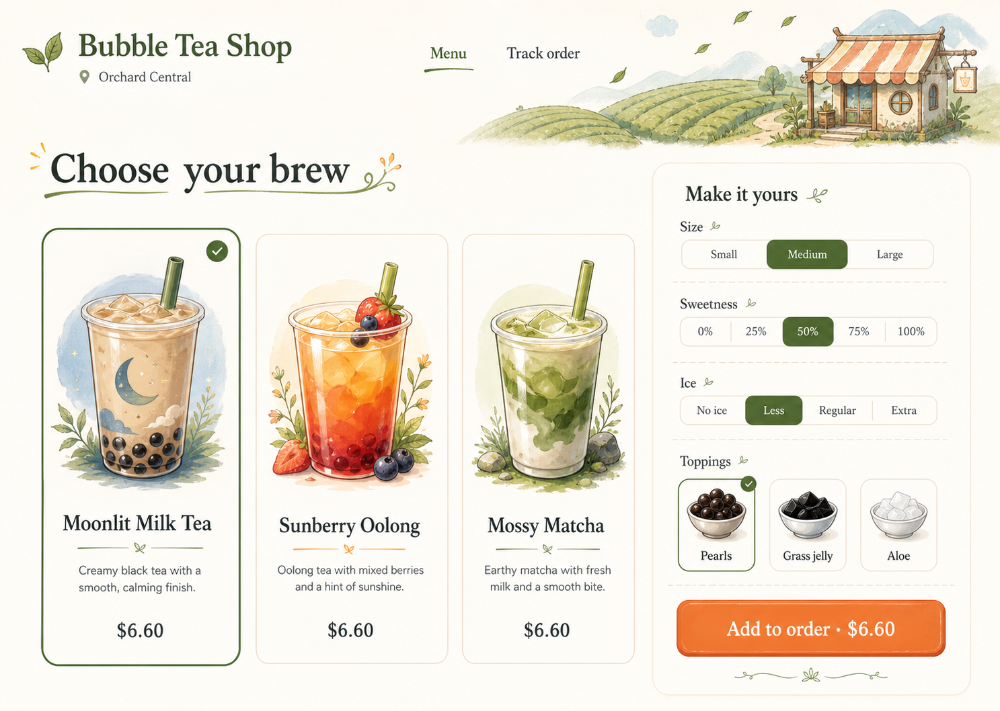

# Customer Ordering Visual Style Guide

This guide defines the selected visual direction for Bubble Tea Shop's customer ordering
experience. It translates the preferred concept image into reusable principles for the future
React, TypeScript, Tailwind CSS, and Radix-based design system. The reference is a direction, not a
pixel-perfect specification; implementation must preserve usability, accessibility, and product
scope as the interface evolves.

The direction is an original, minimalist hand-drawn storybook tea shop. It borrows the sense of
discovery and warmth associated with a gentle 2D fantasy adventure without copying a specific
game, character, logo, interface, or proprietary visual asset.

## Visual reference



This concept image is the preferred visual reference for the customer ordering direction. It is
design guidance only, not a production implementation asset. Product requirements, responsive
behavior, accessibility, and the reusable design-system rules below take precedence over its
specific mock content or layout.

## Visual identity

The customer experience should feel like arriving at a welcoming tea shop at the edge of an
illustrated landscape. Modern ordering controls sit on a calm, light canvas while restrained
storybook scenery, leaves, and ingredient drawings add personality.

The hierarchy is **minimalist first and storybook second**:

- Show the drink, its essential choices, price, and next action before decorative content.
- Use illustration to make products and ingredients memorable, not to turn ordering into a game.
- Keep generous empty space around content so each decision feels simple and deliberate.
- Use a small palette, quiet surfaces, and one dominant action per step.
- Prefer friendly imperfection in drawn accents while keeping text and controls crisp.

## Color palette

Use the following palette as the initial token set. Confirm final foreground and background pairs
with automated contrast checks during implementation.

| Token | Value | Use |
|---|---:|---|
| `canvas` | `#FFFDF7` | Primary page background and visual breathing room |
| `surface` | `#FFF9EE` | Cards, dialogs, and customization panels |
| `ink` | `#23332B` | Primary text and high-contrast line work |
| `forest` | `#496B35` | Selected states, navigation emphasis, and secondary actions |
| `forest-strong` | `#315126` | Accessible text and control states on light surfaces |
| `apricot` | `#F47A32` | The primary ordering action and small moments of emphasis |
| `apricot-strong` | `#C84F16` | Hover, pressed, or text treatment where stronger contrast is needed |
| `sky` | `#A9C9D9` | Illustration accents and quiet informational states |
| `line` | `#E8D9C4` | Dividers, card boundaries, and inactive control outlines |
| `muted-ink` | `#667269` | Supporting copy that still meets contrast requirements |

Do not distribute the accent colors evenly. Ivory should dominate, forest should organize the
interface, apricot should identify the primary action, and sky should remain an illustrative
accent. Never rely on color alone to communicate selection, status, errors, or availability.

## Typography

Use two complementary type roles:

- **Display:** a warm, readable serif for the brand, page titles, and drink names. Choose a face
  with open counters and moderate contrast rather than an ornamental fantasy typeface.
- **Interface:** a highly legible humanist sans serif for prices, descriptions, form labels,
  buttons, status messages, and operational copy.

Keep the type scale restrained. A responsive page title may use `clamp(2.25rem, 5vw, 4.5rem)`;
section titles should normally remain between `1.5rem` and `2rem`; default interface text should
not fall below `1rem`. Prices, labels, and selected values must remain easy to scan. Limit all-caps
text and avoid novelty lettering in interactive controls.

## Layout and spacing

Build pages on an eight-point spacing rhythm with `4px` available only for fine optical
adjustments. Prefer `16px`, `24px`, `32px`, `48px`, and `64px` gaps over tightly packed content.

Desktop ordering pages should use a centered content container with generous outer margins. Menu
browsing and customization may use an approximately 64/36 split: the menu remains primary while
the current choices stay visible in a focused panel. Keep navigation short, place the location
near the brand, and use whitespace rather than decoration to separate sections.

A page should expose only the decisions needed for its current step. Prefer three to six strong
product choices over an unstructured wall of cards; category filters or search can expand the
catalog when real menu size requires them.

## Cards and surfaces

Product cards should feature one large drink illustration, the product name, a short flavor note,
and a clearly formatted price. Use a quiet `1px` boundary, a moderate radius, and little or no
drop shadow. A selected card needs at least two cues, such as a stronger forest outline plus a
check mark.

Customization panels should feel like part of the page rather than a game inventory. Use a single
light surface with logical sections, short dividers, and consistent alignment. Avoid nesting cards
inside cards unless a choice genuinely needs its own interactive boundary.

## Controls and actions

Use standard accessible controls beneath the illustrated presentation:

- Segmented controls work for mutually exclusive, short choices such as size, sweetness, and ice.
- Checkbox-style tiles work for optional toppings and must communicate selection without color
  alone.
- Keep control labels literal: `Medium`, `50%`, `Less ice`, and `Pearls` are preferable to themed
  fantasy language.
- Show price deltas beside options before selection and keep the current total close to the
  primary action.
- Use one dominant apricot action per step, such as `Add to order · $6.60`.
- Reserve forest outlines or text buttons for secondary actions such as editing or returning to
  the menu.

All interactive targets should be at least `44px` square. Keyboard focus must be visible and
should use a high-contrast outline that is not clipped by rounded containers.

## Illustration language

Illustrations should use original hand-drawn line work, simplified cel-shaded color, and subtle
paper texture. Product art may be expressive and detailed enough to distinguish tea type,
toppings, and color. Ingredient icons should remain recognizable at small sizes.

Use scenery sparingly: a tea hill, distant storefront, branch, leaf, or small botanical flourish
can frame a page without competing with ordering. Decorative images must use empty alternative
text. Meaningful product images need concise alternative text that describes the drink rather
than its mood.

Do not reproduce the composition, characters, symbols, type, interface chrome, or recognizable
art style of an existing game or entertainment property. Commissioned or generated assets must
be reviewed for originality before release.

## Responsive behavior

The ordering flow must remain complete from small phones through wide desktop screens.

- **Wide screens:** use the menu/customizer split and allow the customization panel to remain
  visible while the customer reviews nearby products.
- **Tablets:** narrow the product grid and preserve a two-column layout only when controls retain
  comfortable widths.
- **Phones:** show a single-column product list or compact grid. Open customization as a full-page
  step or accessible bottom sheet with a persistent total and primary action.
- Keep text in the document flow; do not bake labels or prices into illustrations.
- Crop decorative scenery before compressing product content or reducing touch targets.
- Preserve the same decision order across breakpoints so customers do not have to relearn the
  flow.

## Accessibility

Target WCAG 2.2 AA for the customer experience. In addition to contrast and target-size rules:

- Preserve semantic heading order, landmarks, labels, descriptions, and error associations.
- Support keyboard-only ordering, screen readers, browser zoom to 200%, and text reflow.
- Announce price and selection changes without moving focus unexpectedly.
- Pair error color with an icon and actionable text; retain entered choices after validation.
- Respect reduced-motion preferences. Any drifting leaf or drawing animation must be decorative,
  subtle, pausable where required, and absent under `prefers-reduced-motion`.
- Keep status updates understandable without animation, sound, or illustration.
- Test generated and hand-drawn assets in high contrast and forced-colors modes; controls must not
  depend on background images.

## Interaction guidance

Interactions should feel light and responsive, not gamified. Use `150–220ms` transitions for
hover, selection, disclosure, and panel movement. A selected ingredient may lift or brighten
slightly, but controls should not bounce, award points, trigger confetti, or simulate combat or
quest progress.

Keep the customer informed with plain language. Confirm an item after it is added, preserve choices
when editing, show unavailable offerings before customization when possible, and explain cash
pickup before the final order action. Loading states should reserve layout space and use simple
skeletons or progress text rather than themed mini-games.

## Customer and staff separation

The storybook identity belongs primarily to public menu browsing, customization, cart, cash
checkout, and guest order status. These routes may use expressive product illustration and gentle
scenery because emotion and product discovery are part of their job.

Staff and owner operations must use a denser, more utilitarian presentation optimized for speed,
accuracy, and repeated daily use. They should share foundational tokens, accessible components,
plain language, and brand recognition with the customer experience, but not its decorative
landscapes or oversized illustrated cards. Inventory tables, recipe editors, order queues, audit
views, and authorization screens should prioritize data density, stable alignment, status clarity,
and keyboard workflows. Never disguise an operational action as a storybook quest or ingredient
collectible.

## Anti-patterns

Avoid:

- dense game HUDs, health bars, maps, inventories, statistics, currencies, quest logs, or side
  quests;
- visual clutter, excessive icons, competing calls to action, and decorative copy around essential
  controls;
- faux-3D panels, skeuomorphic props, isometric controls, heavy gradients, and glossy game buttons;
- busy ornamental chrome, medieval frames, parchment overload, excessive flourishes, and nested
  borders;
- fantasy labels that obscure familiar menu, customization, payment, pickup, or error language;
- tiny text, low-contrast pastel text, color-only selections, and motion required to understand
  state;
- using face recognition, loyalty, achievements, or customer accounts as a primary ordering motif;
- copying any specific game, character, logo, interface, or proprietary visual asset.

## Preferred concept reference prompt

The following is the verbatim prompt used to generate the selected minimalist 2D
fantasy-adventure-inspired concept image. It is retained as a reproducible visual reference, not
as a requirement that future assets reproduce the generated composition exactly.

```text
Use case: ui-mockup
Asset type: high-fidelity preview-only responsive customer web ordering concept, desktop browser viewport 1440x1024
Primary request: Create an original minimalist 2D fantasy-adventure-inspired Bubble Tea Shop menu browsing and drink customization interface. It must evoke a cozy hand-drawn storybook journey without imitating any existing game, franchise, character, logo, UI, or protected art style.
Scene/backdrop: abundant warm ivory whitespace; a very light storybook landscape accent across the upper edge—tiny rolling tea hills, a whimsical distant shop with a striped awning, a few floating leaves—kept sparse and secondary.
Subject: simple brand header "Bubble Tea Shop" with location "Orchard Central" and two nav items "Menu" and "Track order". Main heading "Choose your brew". Left two-thirds: only three large clean menu cards for "Moonlit Milk Tea", "Sunberry Oolong", and "Mossy Matcha", each with one expressive cel-shaded drink illustration, a one-line flavor note, and SGD price; Moonlit Milk Tea selected. Right third: a single rounded customization panel titled "Make it yours" with only essential controls—Size segmented control (Medium selected), Sweetness segmented control (50% selected), Ice segmented control (Less selected), and one compact topping row with three illustrated ingredient tokens (Pearls selected, Grass jelly, Aloe). Show a quiet price line and one unmistakable primary button "Add to order · $6.60".
Style/medium: original hand-drawn 2D storybook illustration accents, crisp bright cel shading, friendly imperfect ink lines, restrained modern product UI, high-fidelity Figma-like responsive web mockup, technically feasible in React/Tailwind/Radix.
Composition/framing: straight-on full browser page, spacious 2-column layout, 64% menu and 36% customizer, huge breathing room, no device frame. The UI is minimalist first and fantasy-flavored second.
Lighting/mood: cheerful morning light, cozy and exploratory, calm rather than game-like.
Color palette: only warm ivory, forest green, apricot orange, and muted sky blue, plus charcoal text.
Materials/textures: very subtle paper grain, soft rounded panels, thin hand-inked accent lines, nearly no shadow.
Text (verbatim): "Bubble Tea Shop", "Orchard Central", "Menu", "Track order", "Choose your brew", "Moonlit Milk Tea", "Sunberry Oolong", "Mossy Matcha", "Make it yours", "Size", "Medium", "Sweetness", "50%", "Ice", "Less", "Toppings", "Pearls", "Grass jelly", "Aloe", "Add to order · $6.60"
Constraints: deliberate minimalism; ample whitespace; sparse readable labels; one clear primary action; only essential menu and customization controls; playful fantasy atmosphere only in small accents and ingredient illustrations; original visual language; accessible contrast; customer-facing; SGD pricing; no login; no face recognition; no loyalty; no staff/admin UI; no backend branding.
Avoid: dense HUD elements, ornate borders, excessive icons, quest logs, side quests, stats, maps, currencies, hearts, XP bars, inventories, weapon imagery, characters, mascots, badges, achievements, gamified clutter, busy game-screen composition, medieval parchment overload, dark fantasy, imitation of any known video game, random fake words, illegible microtext, watermark.
```
