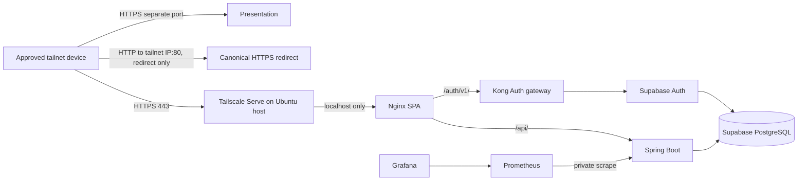

# Homelab deployment plan

Status: planning only. Target branch: `feature/homelab-deployment-plan`. This plan does not authorize a deployment or a change to the homelab host.

## Goal and observed starting point

Deploy the complete Bubble Tea Shop application on the existing Ubuntu 22.04 homelab by pulling a reviewed Git commit over SSH, building and starting a dedicated Docker Compose project, and making the shop reachable only to approved Tailscale devices. The guest storefront, customer and staff sign-in, Spring API, Supabase Auth and PostgreSQL, presentation, and monitoring must survive a host reboot and pass end-to-end checks.

The separate `homelab` repository documents one Ubuntu laptop with Docker Engine, Tailscale, SSH, Home Assistant, Hermes, and media services. Home Assistant uses host networking; existing listeners and capacity must be checked before allocating ports. The recent homelab task confirmed Tailscale connectivity but reported SSH key authentication failure. A read-only SSH attempt during this planning task also returned `Permission denied (publickey,password)`. Actual host configuration, capacity, port use, Docker Compose version, and firewall state remain unverified.

Current `compose.yaml` is a **local development** stack. It binds all host ports to loopback, hard-codes localhost into the frontend build, GoTrue issuer and redirects, Kong CORS, and backend issuer, and automatically creates public fixture accounts with known passwords. Copying it to a shared tailnet would be unsafe and would break remote sign-in. The production deployment contract also requires TLS ingress, protected credentials, private database/backend, and backup/restore.

## Chosen topology



- Give this stack its own Compose project name, network, named volumes, and host directory. No shared volumes or Compose project with Home Assistant/Hermes.
- Publish only the shop Nginx listener on host loopback. Tailscale Serve terminates HTTPS for its MagicDNS name and proxies to that listener. Nginx routes `/api/` to Spring and `/auth/v1/` to Kong on the private Compose network. The browser uses one HTTPS origin for UI, API, and Auth.
- Make `http://<server-tailnet-ip>/` an entry point that redirects to the canonical HTTPS MagicDNS URL. This satisfies IP-based discovery while keeping authenticated browser traffic on HTTPS. Tailscale certificates are issued for tailnet DNS names, not the literal `100.x` address; a direct `https://100.x` URL needs a separately trusted IP certificate. If literal IP browsing with no redirect is essential, decide on that certificate/trust design before rollout.
- Give the presentation a separate tailnet HTTPS port, proxied from its loopback listener. Keep PostgreSQL, Kong, Spring, Studio, Prometheus, and Grafana off the tailnet by default. Reach Studio and monitoring through SSH loopback tunnels; add explicit Serve endpoints later only if there is a demonstrated need and per-service access policy. Do not use Tailscale Funnel or router port forwarding.
- Use a dedicated real owner identity and unique credentials. Do not run the local fixture-account bootstrap services on the homelab. Disable Stripe until its return origin, webhook URL, and provider access are separately validated; a tailnet-only webhook cannot receive provider callbacks.

Tailscale documentation for this design: [Serve private reverse proxy](https://tailscale.com/docs/reference/tailscale-cli/serve), [HTTPS certificates and MagicDNS](https://tailscale.com/docs/how-to/set-up-https-certificates). Verify the installed CLI's syntax and active Serve configuration before applying any command.

| Component | Intended remote path | Host exposure |
| --- | --- | --- |
| Shop, customer/staff UI, Spring API, Auth | Tailscale IP redirect to one HTTPS MagicDNS origin | Frontend Nginx on loopback only |
| Project presentation and video | Separate Tailscale HTTPS port | Presentation Nginx on loopback only |
| Grafana, Prometheus, Supabase Studio | SSH local port forwards over Tailscale | Loopback only; never anonymous tailnet listeners |
| PostgreSQL, Kong, GoTrue, Spring internals | Used by containers; database administration through a controlled SSH tunnel if needed | Compose network only |

## Ordered implementation

### 1. Confirm host access and capacity

**Depends on:** none. **Likely files:** none; private host inventory only.

1. Re-establish key-based SSH to the server through its current Tailscale IP, verify the host key through a separate trusted path, and confirm a second recovery session before any host firewall or SSH change. Do not put live addresses, usernames, host fingerprints, or keys in this repository.
2. Read-only check `tailscale status`, `tailscale ip -4`, `tailscale serve status`, Docker/Compose versions and context, `ss -ltnup`, available CPU/RAM/disk, DNS resolution, firewall rules, Home Assistant container health, and existing Compose projects. Record the results privately.
3. Reserve non-conflicting loopback ports, a deployment directory owned by a non-root service account, a backup destination, and a maintenance window. Estimate build memory and disk needs; use prebuilt images or add swap only if the measured host cannot build safely.

**Acceptance:** SSH works twice from an approved device; Docker uses the intended Ubuntu daemon; ports and capacity are documented privately; existing services are healthy.

### 2. Create a homelab-specific application configuration

**Depends on:** task 1. **Likely files:** `compose.homelab.yaml`, `frontend/nginx.conf` or a homelab variant, `infra/supabase/kong/kong.yml` or a variant, backend Auth configuration and tests, `.env.homelab.example`.

1. Add a dedicated Compose file (or base plus override) with pinned image versions, health checks, `restart: unless-stopped` for long-running services, and explicit project/volume names. Include database, Auth, Kong, Spring, frontend, presentation, Prometheus, and Grafana. Put Studio/Postgres Meta behind an opt-in administration profile or leave them loopback-only. Exclude all three local fixture-account bootstrap services.
2. Parameterize the canonical `https://<server>.<tailnet>.ts.net` origin consistently for frontend `VITE_SUPABASE_URL`, CSP, GoTrue `API_EXTERNAL_URL`, `GOTRUE_SITE_URL`, redirect allowlist, JWT issuer, backend expected issuer, and Kong CORS. Use a same-origin `/auth/v1/` Nginx proxy. Ensure the public anon key, if required, is built into the frontend from the generated deployment value; keep service-role and signing keys server-only.
3. Remove the backend validator's internal-HTTP-only restriction on the **issuer** for this deployment: HTTPS public issuer must be accepted while JWKS remains an internal Compose URL. Test exact issuer validation, including rejection of the old localhost issuer. Keep production profile fail-closed for missing credentials.
4. Bind browser ingress and optional presentation/administration listeners only to `127.0.0.1`; do not publish database, backend, Auth, or Kong on a LAN interface. Use a strong database password and fresh asymmetric signing keys generated once on the host. Put secrets in an ignored owner-readable environment file, never in image layers or Git. Remove all known demo credentials.
5. Confirm the intended database role and transport satisfy `docs/operations/deployment.md`. If self-hosted private-network PostgreSQL intentionally uses no TLS, document that explicit homelab exception and its network boundary rather than claiming the existing production contract is met.

**Acceptance:** rendered Compose configuration contains the canonical origin and loopback bindings; no fixture users or passwords remain; backend accepts HTTPS issuer and private JWKS; tests cover sign-in origin behavior.

### 3. Add repeatable host deployment and recovery steps

**Depends on:** task 2. **Likely files:** `infra/homelab/` scripts or runbook, `docs/operations/` deployment/backup documentation.

1. Document a first-time clone over SSH into a dedicated directory and a deploy command that fetches a reviewed branch/tag, checks out its exact commit, prints the SHA, validates Compose (`docker compose config` with redacted output), builds/pulls images, and starts the project without removing volumes. Avoid `git pull` on an uncontrolled working tree.
2. Define one-time owner creation through normal Auth signup plus the existing audited Spring owner-bootstrap command. Store the owner subject privately, run the command once, then prove the long-running backend has bootstrap disabled. Decide whether self-service customer signup is enabled and how email verification works; the current local stack auto-confirms email without SMTP.
3. Schedule a full PostgreSQL backup covering **both** application and Supabase Auth schemas, plus Compose definitions and the minimum secrets needed to restore identities. Encrypt and copy off-host; test restore into a disposable isolated project. The existing `infra/postgres/backup.sh` covers only the `public` schema and is insufficient alone.
4. Document restart after reboot, image and migration compatibility, data-preserving rollback, log inspection, disk thresholds, and alerts. Never use `docker compose down --volumes` during normal operations.

**Acceptance:** a dry run from a clean checkout reaches a deterministic SHA; backup/restore drill recovers a test login and application data; reboot procedure is reproducible.

The eventual host runbook should make the operator path this explicit, using private values supplied on the host:

```bash
ssh <homelab-ssh-alias>
git clone git@github.com:Cyrus-Krispin/bubble-tea-shop.git <deployment-directory>
cd <deployment-directory>
git fetch --tags origin
git checkout --detach <reviewed-commit-sha>
git rev-parse HEAD
docker compose --project-name bubble-tea-shop --env-file <private-env-file> -f compose.homelab.yaml config --quiet
docker compose --project-name bubble-tea-shop --env-file <private-env-file> -f compose.homelab.yaml up -d --build
docker compose --project-name bubble-tea-shop --env-file <private-env-file> -f compose.homelab.yaml ps
```

This is a command shape, not a runnable recipe yet: the dedicated Compose file, service credentials, exact host directory, and validated rollout script are implementation tasks. Subsequent releases should fetch and check out a new reviewed SHA in the same directory, after backup and migration review.

### 4. Configure private Tailscale ingress

**Depends on:** tasks 1 and 2. **Likely files:** runbook and optional proxy config; Tailscale ACLs are administered outside this repository.

1. Enable MagicDNS and HTTPS certificates for the tailnet if they are not already enabled. Review the certificate-name disclosure shown by Tailscale before enabling. Restrict inbound access to the intended users/devices with tailnet policy; verify the host firewall does not accidentally expose the same listeners on LAN/WARP.
2. Apply a persistent Tailscale Serve HTTPS proxy to the frontend loopback port. Add an HTTP port-80 Serve rule for the tailnet IP that serves only a redirect to the canonical HTTPS URL. Configure a separate HTTPS port for the presentation. Record exact commands **after** checking the host's installed Tailscale version and pre-existing Serve state, so unrelated mappings are preserved.
3. Keep Grafana anonymous access and Studio off the tailnet; use `ssh -L` for their loopback ports. Confirm no Funnel mapping, router port forward, or accidental LAN listener exists.

**Acceptance:** an approved remote device opens `http://<tailnet-ip>/` and lands on the HTTPS shop; an unapproved device cannot reach it; presentation HTTPS works; LAN/public reachability checks fail for protected services.

### 5. Run the full deployment smoke test

**Depends on:** tasks 1-4. **Likely files:** smoke-test/runbook updates only.

1. On the host: `docker compose ps` shows all long-running services healthy, one-time jobs completed, PostgreSQL persisted data, Spring readiness, Auth health, frontend and presentation health, and Prometheus target up. Check logs for issuer, CORS, migration, and secret exposure errors.
2. From a separate approved tailnet device with LAN disabled: use the IP redirect, load catalog and images, create a guest cash order, register/sign in a customer, sign in as real owner/staff, complete a cash order, and verify inventory/receipt changes. Test refresh and sign-out. Confirm all browser requests use the canonical HTTPS origin and there are no mixed-content or CORS failures.
3. Open the presentation and video. Through an SSH tunnel, inspect Grafana, Prometheus, and Studio. Reboot during the maintenance window and repeat health checks. Restore a disposable backup and verify an Auth login plus representative order/inventory records.

**Acceptance:** all listed flows work from a remote tailnet client; no demo accounts exist; services recover after reboot; backup and restore evidence is recorded privately.

## Release gate and rollback

Before host rollout, run the affected backend suite (`cd backend && ./mvnw verify`), frontend `pnpm test`, `pnpm typecheck`, `pnpm lint`, `pnpm build`, Compose config validation, focused Kong/infra tests, and a local end-to-end browser smoke test. Review the diff and secrets scan, commit the implementation on its own branch, then push and deploy a known SHA. Check pending Flyway migrations and a verified backup before starting the new images.

If the new stack fails before users create data, stop the new Compose project and leave existing homelab services untouched. After data is written, application rollback is allowed only if the previous image is schema-compatible; otherwise restore from a verified checkpoint with Auth and application data together. Preserve all named volumes until the recovery decision is complete.

## Decisions still needed before implementation

1. Which approved tailnet users/devices may reach the shop and presentation? Keep policy details private.
2. Is a redirect from the Tailscale IP to the HTTPS MagicDNS name acceptable, or must the browser remain on the literal IP? The latter needs an IP-certificate/trust design.
3. Should customer self-signup be enabled on this personal homelab, and what email delivery/verification policy is expected?
4. Is the presentation intended for the same tailnet audience as the shop? Should Grafana/Studio ever be exposed beyond SSH tunnels?
5. Are card payments out of scope for this private deployment? Public Stripe webhooks and return URLs require a separate ingress design.

These questions do not block preparing the configuration and tests. They do block declaring the final exposed service policy complete.
